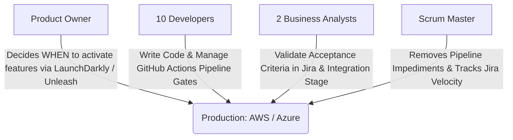
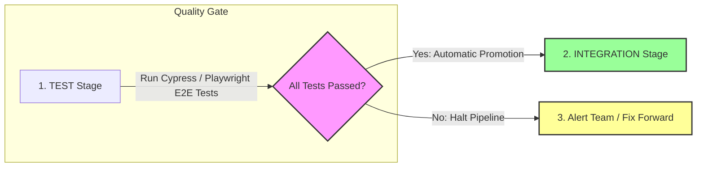
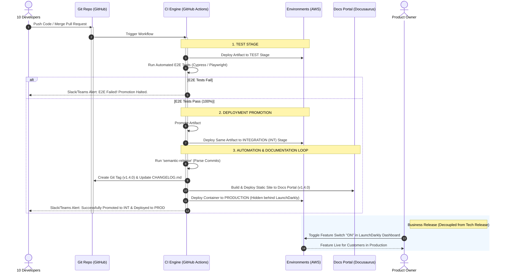

# Modern Release Management in Agile & CI/CD Ecosystems

## 1. Executive Summary
In a modern software development environment driven by Agile principles and automated deployment pipelines, the traditional role of a dedicated **Release Manager** is obsolete. For a single cross-functional team, introducing a Release Manager creates unnecessary bottlenecks, communication silos, and bureaucracy. 

Instead, release responsibilities are decentralized and absorbed by automation (CI/CD) and the existing team roles. This approach shifts the focus from manual gatekeeping to continuous value delivery through strict quality-gated pipelines.

---

## 2. Team Composition & Responsibility Matrix
For a team consisting of **10 Developers, 1 Scrum Master, 1 Product Owner, and 2 Business Analysts**, responsibilities are distributed as follows:

*   **10 Developers (DevOps Mindset):** Own the technical release and pipeline health. They configure the automated quality gates (such as E2E test suites) that block or allow deployment promotion between stages.
*   **Product Owner (PO):** Decides *business relevance*. By decoupling technical deployment from commercial release using feature flag platforms like **LaunchDarkly** or **Unleash**, the PO controls when users see new features in Production.
*   **2 Business Analysts (BA):** Ensure alignment between **Jira** user stories and delivered value. They validate system behavior directly in the *Integration (INT)* stage once it passes automated checks.
*   **1 Scrum Master (SM):** Facilitates continuous improvement. Coaches the team to optimize flow metrics and helps remove blockers when automated testing gates fail.

---

## 3. Deployment Promotion & Quality Gates (TEST to INT)
Instead of a Release Manager signing off on a release spreadsheet, the pipeline acts as an immutable gatekeeper. The infrastructure utilizes a strategy called **Deployment Promotion**.

### The Promotion Workflow:
1.  **TEST Stage Deployment:** Every pull request or merge automatically deploys the latest microservices/artifacts to an isolated **TEST** environment.
2.  **Automated E2E Testing:** The pipeline triggers a comprehensive End-to-End (E2E) testing framework (e.g., **Cypress**, **Playwright**, or **Selenium**), simulating real user journeys across the entire system.
3.  **The Quality Gate:** 
    *   **If E2E tests fail:** The promotion is immediately halted. No bad code leaves the TEST stage. The team receives an instant alert to fix it forward or revert.
    *   **If E2E tests pass (100% success):** The pipeline automatically triggers a **Deployment Promotion**. The exact same verified artifact/container image is safely pushed and deployed to the **INTEGRATION (INT)** stage for cross-team alignment and final BA verification.

---

## 4. Automated Documentation & Release Notes Flow
Relying on human intervention to write release notes or update documentation is error-prone. In a mature CI/CD ecosystem, these artifacts are treated as code (**Documentation-as-Code**) and generated automatically upon successful code promotion.

*  **Conventional Commits:** Developers use structured commit messages linked to Jira tickets (e.g., `feat(auth): add OAuth2 login support Closes PROJ-123`).
*  **Automated Versioning (Semantic Release):** Once code successfully passes the gates and triggers a release, the pipeline parses commits and calculates the next version using Semantic Versioning (e.g., `v1.4.0`).
*  **Automated Artifact Generation:** A tool like **semantic-release** compiles a `CHANGELOG.md` file, updates **Jira** tickets, and triggers **Docusaurus / MkDocs** to publish versioned technical documentation to an internal portal (e.g., **GitHub Pages** or **Confluence Cloud** via API).

---

## 5. End-to-End Automated Pipeline Workflow
The diagram below illustrates the exact execution path, highlighting how the automated E2E testing suite acts as the sole gatekeeper for promoting software to the Integration stage and beyond:

---

## 6. Key Benefits of This Model
*   **Zero Manual Gatekeeping:** The pipeline enforces the quality rules. If a bug is caught by the E2E tests, the system blocks the release automatically before it can corrupt the Integration environment.
*   **Immutable Artifacts:** The exact same build tested in the TEST environment is promoted to INT and PROD, eliminating the "it worked on my machine/environment" issue.
*   **Always Up-to-Date Docs:** Documentation and release notes are only generated and updated when code successfully survives the automated promotion process.
